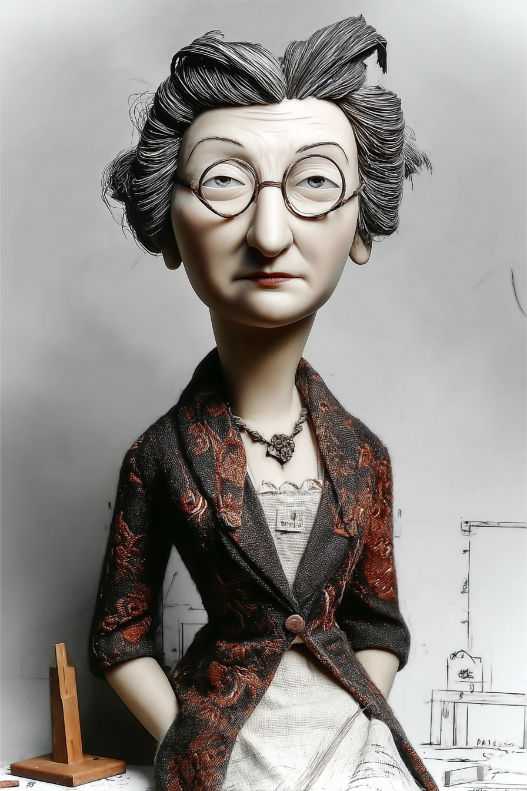
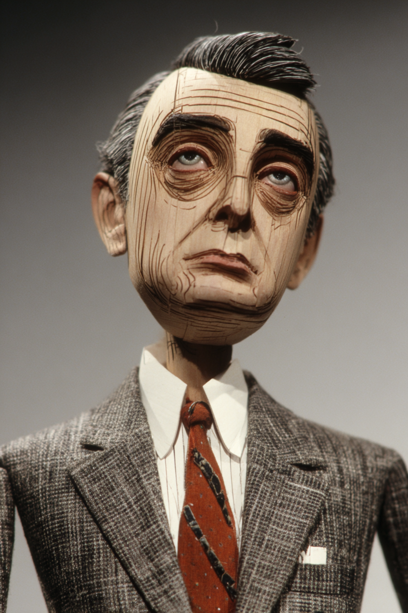
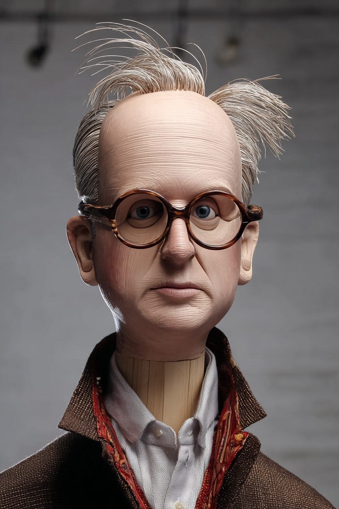

# Introduction to Intellectual Property — Wayback Sections

> Extracted from `chapters/`. Each entry corresponds to one chapter file.
> Sections are instructor-authored. Missing sections show a placeholder only.
> Do not edit this file directly — edit the source chapter file, then re-run extraction.

---

## Chapter 00: Introduction to Intellectual Property: with LLMs
*Source: `chapters/00-frontmatter.md`*

> **Section not yet authored.** No `## AI Wayback Machine` block found in this chapter file.
> To add this section, edit the source chapter file directly.

---

## Chapter 00: Introduction
*Source: `chapters/00-introduction.md`*

> **Section not yet authored.** No `## AI Wayback Machine` block found in this chapter file.
> To add this section, edit the source chapter file directly.

---

## Chapter 01: Chapter 1 — Patent Basics
*Source: `chapters/01-patent-basics.md`*

##  AI Wayback Machine
**Edith Clarke** was first woman to earn an electrical engineering degree at MIT (1919) — and the first woman elected as a fellow of the IEEE. Her patents in power systems were foundational, and the path she walked through the patent system was a first.



*Puppet Art by [Nik Bear Brown](https://www.nikbearbrown.com/).*

**Run this:**

```
Who is Edith Clarke, and how does their work connect to patent basics we covered in this chapter? Keep it to three paragraphs. End with the single most surprising thing about their career or ideas.
```

→ Search **"Edith Clarke"** on Wikipedia.

**Now make the prompt better.** Try one of these:

- Ask it to apply Edith Clarke's framework to a specific IP question.
- Add a constraint: "Answer including criticisms or limits of Edith Clarke's framework."

What changes? What gets better? What gets worse?

---

## Chapter 02: Chapter 2 — Patent Enforcement
*Source: `chapters/02-patent-enforcement.md`*

##  AI Wayback Machine
**Edwin Land** was Polaroid founder whose patent enforcement strategy against Kodak (after Kodak infringed instant-photography patents) became a textbook case in patent litigation.



*Puppet Art by [Nik Bear Brown](https://www.nikbearbrown.com/).*

**Run this:**

```
Who is Edwin Land, and how does their work connect to patent enforcement we covered in this chapter? Keep it to three paragraphs. End with the single most surprising thing about their career or ideas.
```

→ Search **"Edwin Land"** on Wikipedia.

**Now make the prompt better.** Try one of these:

- Ask it to apply Edwin Land's framework to a specific IP question.
- Add a constraint: "Answer including criticisms or limits of Edwin Land's framework."

What changes? What gets better? What gets worse?

---

## Chapter 03: Chapter 3 — Copyright Basics
*Source: `chapters/03-copyright-basics.md`*

##  AI Wayback Machine
**Lawrence Lessig** was legal scholar who founded Creative Commons in 2001 — reshaping the modern conversation about copyright, sharing, and the public domain.



*Puppet Art by [Nik Bear Brown](https://www.nikbearbrown.com/).*

**Run this:**

```
Who is Lawrence Lessig, and how does their work connect to copyright basics we covered in this chapter? Keep it to three paragraphs. End with the single most surprising thing about their career or ideas.
```

→ Search **"Lawrence Lessig"** on Wikipedia.

**Now make the prompt better.** Try one of these:

- Ask it to apply Lawrence Lessig's framework to a specific IP question.
- Add a constraint: "Answer including criticisms or limits of Lawrence Lessig's framework."

What changes? What gets better? What gets worse?

---

## Chapter 04: Chapter 4 — Trademark Basics
*Source: `chapters/04-trademark-basics.md`*

##  AI Wayback Machine
**Frank Schechter** was lawyer whose 1927 Harvard Law Review article "The Rational Basis of Trademark Protection" founded the modern theory of trademark as more than just consumer protection.

**Run this:**

```
Who is Frank Schechter, and how does their work connect to trademark basics we covered in this chapter? Keep it to three paragraphs. End with the single most surprising thing about their career or ideas.
```

→ Search **"Frank Schechter"** on Wikipedia.

**Now make the prompt better.** Try one of these:

- Ask it to apply Frank Schechter's framework to a specific IP question.
- Add a constraint: "Answer including criticisms or limits of Frank Schechter's framework."

What changes? What gets better? What gets worse?

---

## Chapter 05: Chapter 5 — Trade Secret Basics
*Source: `chapters/05-trade-secret-basics.md`*

##  AI Wayback Machine
**Sandra Day O'Connor** was first woman on the US Supreme Court — and authored important decisions on trade secrets and the relationship between state and federal IP law.

**Run this:**

```
Who is Sandra Day O'Connor, and how does their work connect to trade secret basics we covered in this chapter? Keep it to three paragraphs. End with the single most surprising thing about their career or ideas.
```

→ Search **"Sandra Day O'Connor"** on Wikipedia.

**Now make the prompt better.** Try one of these:

- Ask it to apply Sandra Day O'Connor's framework to a specific IP question.
- Add a constraint: "Answer including criticisms or limits of Sandra Day O'Connor's framework."

What changes? What gets better? What gets worse?

---

## Chapter 99: 99 Back Matter
*Source: `chapters/99-back-matter.md`*

> **Section not yet authored.** No `## AI Wayback Machine` block found in this chapter file.
> To add this section, edit the source chapter file directly.

---
